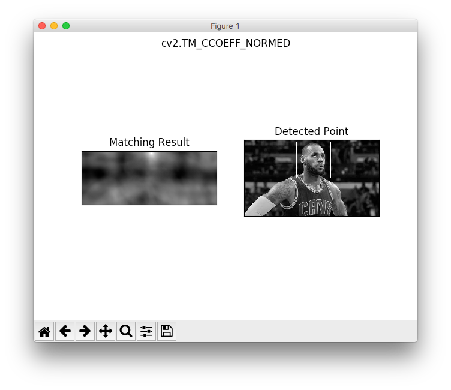
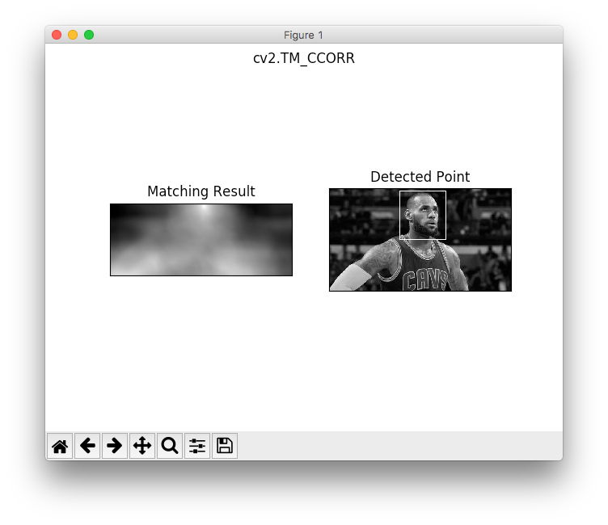
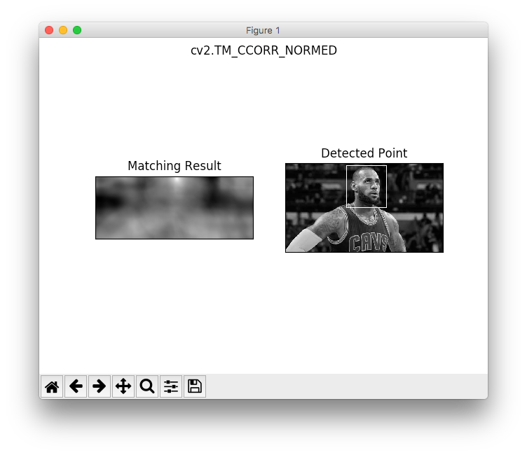
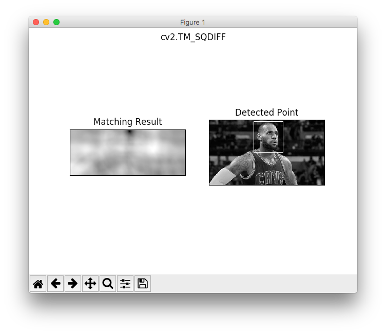
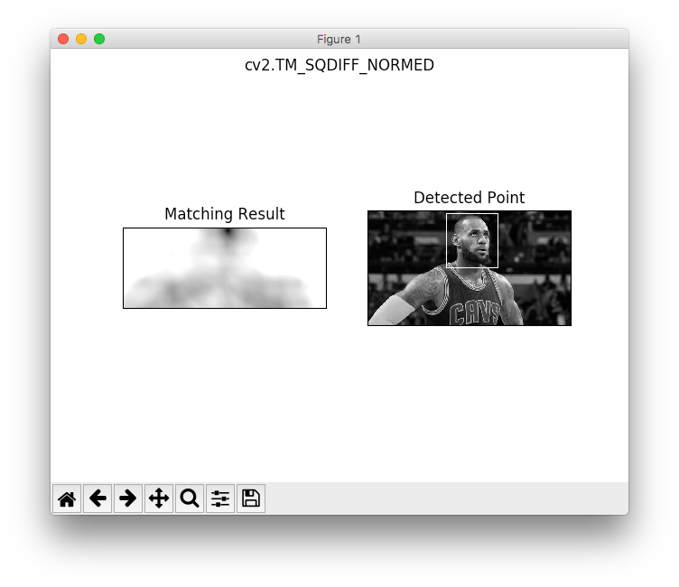

## tempate_matching

http://docs.opencv.org/3.2.0/d4/dc6/tutorial_py_template_matching.html

### TM_CCOEFF

### TM_CCOEFF_NORMED

### TM_CCORR

### TM_CCORR_NORMED

### TM_SQDIFF

### TM_SQDIFF_NORMED

